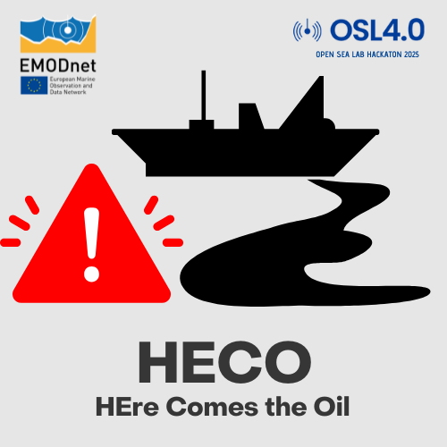
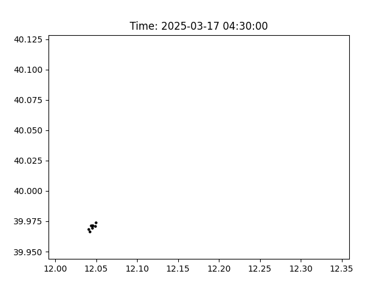
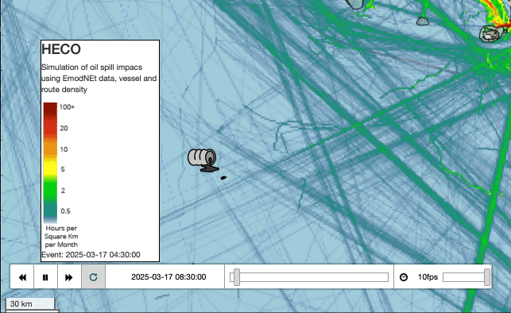

# HEre Comes the Oil

*HECO* (HEre Comes the Oil) is an advanced system for monitoring and forecasting oil dispersion at sea, designed to ensure a swift response to spills caused by accidents. Its main innovation lies in integrating a high-performance computational model with real-time maritime and environmental data, enabling a fast and accurate assessment of pollution impact.

**Warning**
<div style="padding: 10px; border: 1px solid orange; background-color: #fff3cd; color: #856404; border-radius: 5px;">
  <strong>DISCLAIMER</strong> The simuator algorytm is not validated by peer reviewers. This is a <b>Proof of Concept- level product! USE IT ONLY FOR TESTING SCENARIO</b> 
</div>

This project use the CMSES dataset API; accessing and obtain marine current wave variables with Copernicus Marine Services User credentials (username and password).

More info about `copernicusmarine` API --> [link](https://help.marine.copernicus.eu/en/articles/8287609-copernicus-marine-toolbox-api-open-a-dataset-or-read-a-dataframe-remotely)

## Installation

To set up the project, clone the repository and install the required dependencies.
You can do this by running some command from you CLI:

```
virtualenv heco
source bin/activate
pip install -r requirements.txt
```

The file `requirements.txt`contain a list of all package and python dependencies needs (and others useful too).
The `heco.py` file contain all functions developed for this tool.

## Workflow

Follow the instruction in the computational notebook [HECO](HECO.ipynb)

The procedure is divided in two main steps.

First step compute an oil-spill scenario using wave velocity forecast dataset in a dispersion-lagrangian model.



A second step is compute geo-spatial feature to assess impact on Human activity and natural protected areas. Using powerful Python scipt HECO produce in seconds a single-page webmap with animation of spill and some geo-data. Useful for sharing on the web and early alert comunications.




### 

## Contributing

If you would like to contribute to this project, please fork the repository and submit a pull request with your changes.

## License

This project is licensed under the MIT License. 
See the LICENSE file for more details.