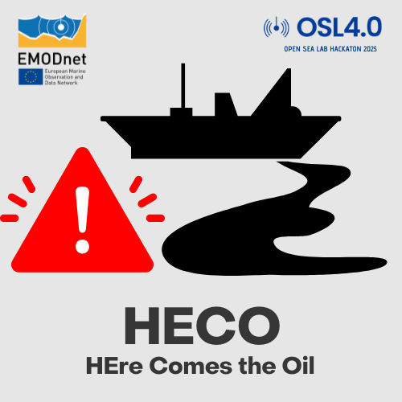
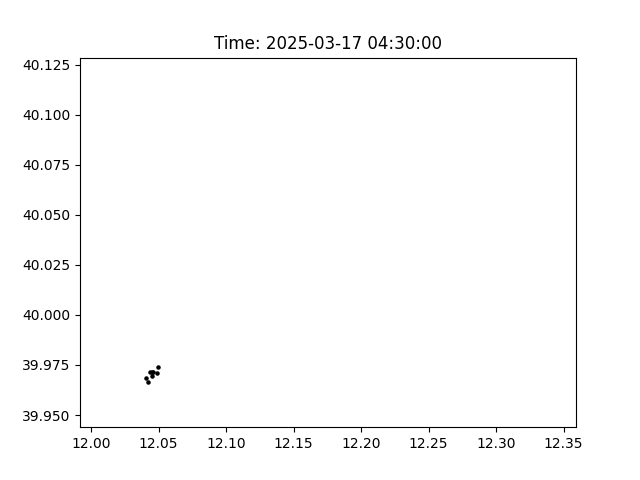
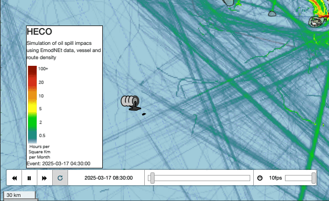
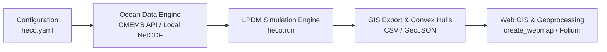

<!-- <p align="center">
  
</p> -->

# HECO: HEre Comes the Oil

[](LICENSE)
[](https://www.python.org/)
[](https://marine.copernicus.eu/)
[](https://www.sciencedirect.com/science/article/pii/S0964569126002875)


**HECO** (*HEre Comes the Oil*) is an advanced computational framework for real-time monitoring, forecasting, and impact assessment of marine oil spills. By coupling high-performance **Lagrangian Particle Dispersion Models (LPDM)** with real-time ocean current dynamics from the **Copernicus Marine Environment Monitoring Service (CMEMS)**, HECO produces rapid dispersion trajectories and interactive web-based GIS visualizations to support emergency response and environmental protection.

> Paper published on Ocean & Coastal Management [DOI: 10.1016/j.ocecoaman.2026.108378](https://www.sciencedirect.com/science/article/pii/S0964569126002875)

<!-- 🔗 **Live Interactive Demo:** [Explore HECO Web Map](https://seaquestteam.github.io/HECO/heco/heco_map.html) -->

---

## Overview & Visualizations

<p align="center">
  
  
</p>

---

## Key Features

- **Lagrangian Oil Spill Dispersion Modeling:** Simulates advection and random-walk turbulent diffusion of spilled oil particles driven by CMEMS 2D/3D ocean current forecasts (`uo`, `vo`).
- **Continuous & Instantaneous Release Modes:** Models single point-source spills as well as discrete multi-step continuous releases over specified timeframes (`spill_release_duration_h`).
- **Deterministic Reproducibility & Vector Interpolation:** Supports fixed seed/RNG initialization for reproducible stochastic runs, along with bilinear velocity interpolation (`interpolated=True`).
- **Automated Web GIS & EMODnet Integration:** Generates standalone single-page Folium web maps featuring animated particle time-series, slick boundary convex hulls, and overlays for EMODnet Marine Protected Areas & Human Activities.
- **Observed Polygon Overlays & Model Validation:** Built-in tools for overlaying satellite-observed spill footprints to evaluate model performance using spatial metrics (IoU, Hausdorff distance, spatial overlap).
- **Sensitivity & Calibration Suite:** Comprehensive modules for Monte Carlo sensitivity analysis, origin perturbation assessments, and parallel diffusion coefficient ($D$) calibration.
- **Cloud & Local Compatibility:** Designed for zero-setup execution in the **EDITO Data Lab** cloud environment or local Python installations.

---

## 1. Quick Start

### Option A: EDITO Data Lab (Cloud Environment — Recommended)

The easiest way to execute HECO without local dependency installation is within the **EDITO Data Lab**:

1. Log in to [datalab.dive.edito.eu](https://datalab.dive.edito.eu).
2. In the **Service Catalog**, launch **Jupyter-python-ocean-science** (using default settings).
3. Open the Jupyter server using the access token provided upon service launch.
4. Open the **Git** menu (left sidebar) and select `Clone Repository` using this repository's URL.
5. Open a Jupyter Terminal and install requirements:
   ```bash
   pip install -r requirements.txt
   ```
6. Open [`heco/HECO.ipynb`](heco/HECO.ipynb) and run the interactive cells.

### Option B: Local Installation

To set up HECO on your local machine:

```bash
# 1. Clone the repository
git clone https://github.com/seaquestteam/HECO.git
cd HECO

# 2. Create and activate a virtual environment
python3 -m venv heco_env
source heco_env/bin/activate        # Linux / macOS
# heco_env\Scripts\activate          # Windows

# 3. Install required dependencies
pip install -r requirements.txt
```

---

## 2. Execution & Workflow

The HECO operational pipeline follows two primary stages:


```mermaid
flowchart LR
    A[Configuration<br>heco.yaml] --> B[Ocean Data Engine<br>CMEMS API / Local NetCDF]
    B --> C[LPDM Simulation Engine<br>heco.run]
    C --> D[GIS Export & Convex Hulls<br>CSV / GeoJSON]
    D --> E[Web GIS & Geoprocessing<br>create_webmap / Folium]
```

1. **Hydrodynamic Data Ingestion & Advection-Diffusion:** Fetches CMEMS ocean current data (or reads local `.nc` files) and simulates particle displacement over specified forecasting horizons.
2. **Geoprocessing & Interactive Web Mapping:** Calculates convex hulls around particle clouds at each timestep and generates an interactive, animated HTML web map integrated with EMODnet environmental layers.

---

## 3. Fast Track (Python SDK & CLI)

You can run HECO programmatically in Python without using Jupyter notebooks.

### A. Configuration Schema (`heco.yaml`)

Create a configuration file (e.g., `heco.yaml`) defining the simulation parameters:

```yaml
input:
  credential_path: credentials.yaml    # Path to CMEMS API credentials (optional if dataset_file_name is set)
  dataset_file_name: heco/HECO_TEST.nc  # Path to local NetCDF dataset file (optional)
  lat0: 35.491                          # Latitude of spill origin (WGS84)
  lon0: 34.911                          # Longitude of spill origin (WGS84)
  sim_diffusion_coeff: 10.0            # Diffusion coefficient D (m^2/s, typically 1 - 100)
  sim_duration_h: 72                    # Forecast duration in hours
  sim_particles: 500                    # Total number of Lagrangian particles
  sim_timedelta_s: 3600                 # Integration timestep in seconds (3600s = 1h)
  spill_release_duration_h: 6.0        # Spill release duration in hours (discrete release)
  time0: '2021-08-24 16:36:07'          # Spill origin timestamp (YYYY-MM-DD HH:MM:SS)
  volume_spilled_m3: 1000.0             # Estimated total volume spilled in m^3
```

#### Parameter Reference Table

| Variable | Type | Unit | Description |
| :--- | :---: | :---: | :--- |
| `credential_path` | `str` | - | *(Optional)* Path to YAML file containing CMEMS `username` and `password`. |
| `dataset_file_name` | `str` | - | *(Optional)* Path to local `.nc` NetCDF ocean current file. |
| `lat0` / `lon0` | `float` | deg | Latitude and Longitude of the spill origin point (WGS84). |
| `sim_diffusion_coeff` | `float` | $m^2/s$ | Horizontal diffusion coefficient $D$ (default: `10.0`). |
| `sim_duration_h` | `int` | hours | Total forecast simulation duration. |
| `sim_particles` | `int` | - | Total count of Lagrangian particles simulated. |
| `sim_timedelta_s` | `int` | sec | Model integration timestep in seconds (default: `3600`). |
| `spill_release_duration_h` | `float` | hours | Duration of continuous spill release (distributes particles across multiple steps if $>1$). |
| `time0` | `str` | timestamp | Event start time (`YYYY-MM-DD HH:MM:SS`). |
| `volume_spilled_m3` | `float` | $m^3$ | Estimated volume of oil released. |

> [!TIP]
> **Performance Hack:** Downloading the regional NetCDF dataset from [Copernicus Marine](https://data.marine.copernicus.eu/product/MEDSEA_ANALYSISFORECAST_PHY_006_013/) locally and specifying `dataset_file_name` bypasses real-time API queries, significantly speeding up execution.

---

### B. Python API Usage

```python
import heco
import geopandas as gpd

# 1. Run Lagrangian oil spill simulation
#    Supports reproducibility (seed/rng) and spatial interpolation
output_df = heco.run(
    'heco.yaml',
    seed=42,             # Reproducible stochastic generator
    interpolated=True    # Bilinear vector interpolation for uo, vo
)

# 2. Export raw particle trajectory data
output_df.to_csv('heco_results.csv', index=False)

# 3. Save as GeoDataFrame / GeoJSON
gdf = gpd.GeoDataFrame(
    output_df,
    geometry=gpd.points_from_xy(output_df.lon, output_df.lat),
    crs="EPSG:4326"
)
gdf.to_file('heco_results.geojson', driver='GeoJSON')

# 4. Generate animated web GIS map with EMODnet layers & optional observed polygon
heco.create_webmap(
    HECOpoint_output_gdf_path='heco_results.geojson',
    settingsFile_path='heco.yaml',
    output_path='heco_map.html',
    EMODnetLayers=True,
    savepolygons=True,
    observed_polygon_path=None  # Path to observed slick polygon (optional)
)
```

---

## 🔬 4. Sensitivity Analysis & Model Validation

HECO includes an extensive research suite for model evaluation, sensitivity testing, and diffusion parameter calibration:

- 📊 **Diffusion Coefficient Calibration (`heco/validation_test/`):** Parallel calibration frameworks (`HECO-validation-test-3_calibration_diffusion_parallel.ipynb`) evaluating 150+ diffusion parameter configurations against satellite-observed oil slicks.
- 🎯 **Origin Perturbation & Monte Carlo Analysis (`heco/sensivity_analysis/`):** Quantitative spatial metrics (Jaccard Index / IoU, Hausdorff distance, boundary overlap via `polygons_score.py`) analyzing model robustness under origin location and velocity field uncertainties.
- 📈 **Interpolation vs. Nearest-Neighbor Comparisons:** Evaluated particle dispersion dynamics under raw grid lookup versus continuous bilinear interpolation.


---

## 🤝 Contributing & License

- **Contributing:** Contributions, bug reports, and feature requests are welcome! Please fork the repository and submit a Pull Request.
- **License:** Licensed under the **MIT License**.
- Please cite:

Di Pietro, G., Marino, M., Stagnitti, M., Castro, E., Nasca, S., Cavallaro, L., Foti, E., & Musumeci, R. E. (2026). HECO: A lightweight CMEMS-based oil-spill risk-assessment tool. Ocean & Coastal Management, 282, 108378. https://doi.org/10.1016/j.ocecoaman.2026.108378

or using [Citation.cff](HECO/CITATION.cff) file.

### 👥 Authors & Affiliations

**University of Catania** — Department of Civil and Architecture Engineering (DICAR):
- **Gianfranco Di Pietro** (PhD Student / Lead Developer)
- **Massimiliano Marino**
- **Martina Stagnitti**
- **Elisa Castro**
- **Sofia Nasca**
- **Enrico Foti**
- **Supervisor:** Prof. Rosaria Ester Musumeci
